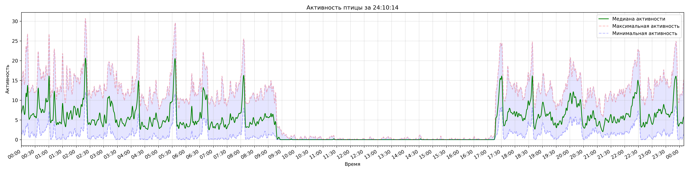
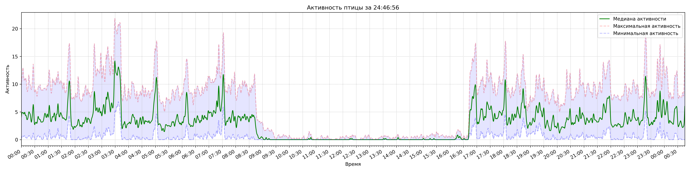
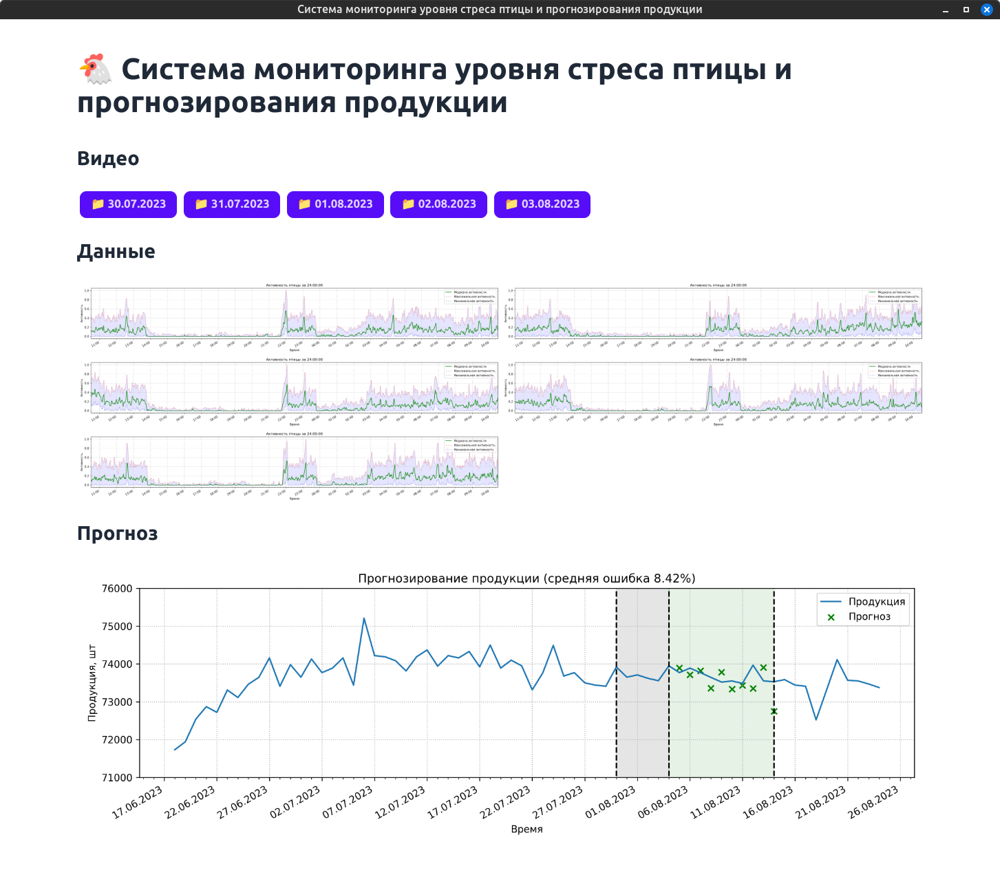

# 🐓 ChickensWantToLive 🐓

В этом проекте проводится исследование активности кур на птицеферме с дальнейшим анализом влияния стресса птицы на показатели их продуктивности

## Структура

- `videos` - в этой директирии находятся видео-файлы с камеры `Hikvision`. Необходимо скопировать видео-файлы с SD-карты и разместить их в директории с датой записи. Например `videos/01.06.2023`.

- `remuxed` - в этой директории находятся преобразованные видео-файлы.

- `datasets` - в эту директорию необходимо поместить набор данных для обучения нейросетевой модели. Набор можно скачать по [ссылке](https://universe.roboflow.com/pavel-vasiliev/chickens-want-to-live-2k). Выбрать последнюю доступную версию в формате `YOLOv8` и скачать `zip` архив. После чего распаковать содержимое архива в эту директорию.

- `frames` - в этой директории находятся извлеченные кадры из обработанных видео-файлов. Эти кадры используются для подготовки и дополнения набора данных.

- `training` - в этой директории находятся файлы обучения нейросетевой модели, сохрененные контрольные точки, экспортированные веса модели.

- `processing` - в этой директории находится результат обработки видео-файлов и графики активности птицы.

- `weights` - в этой директории находятся файлы весов предобученных моделей `YOLOv8`.

- `utils` - в этой директории находятся ключевые файлы запуска.

## Этапы работы

### 1. Установка зависимостей

```bash
pip3 install -r requirements.txt
```

### 2. Обработка видео-файлов

В процессе записи видео-файлов на SD-карту камеры происходит нарушение целостности временных отметок. Необходимо предварительно обработать видео-файлы:

```bash
python3 utils/remux_video_files.py 01.06.2023
```

Файлы из директории `videos/01.06.2023` будут обработаны и размещены в `remuxed/01.06.2023`.

### 3. Извлечение кадров из видео-файлов

После того как видео-файлы обработаны, можно извлечь необходимое количество кадров. Кадры извлекаются случайным образом.

```bash
python3 utils/extract_frames.py 01.06.2023 1000
```

Из видео-файлов в директории `remuxed/01.06.2023` будут извлечены `1000` кадров и помещены в директорию `frames/01.06.2023`. Эти кадры можно выгрузить в `Roboflow` для разметки.

### 4. Обучение нейросетевой модели

После разметки кадров из видео-файлов и формирования набора данных необъодимо обучить нейросетевую модель `YOLOv8`. Предварительно нужно убедиться в наличии набора данных в директории `datasets`.

```bash
 python3 utils/train_network.py
```

При каждом новом запуске предыдущие обучения будут удалены. В результате обучения веса модели будут экспортированы в формате `TensorRT` в файл `best.engine` в директории `training/take/weights`.

### 5. Обработка видео-файлов для оценки активности птицы

Для того, чтобы проанализировать активность за определенное время, необходимо обработать видео-файлы нейронной сетью и получить количество детекций птицы для каждого кадра видео-файла.

> _На данный момент отсутствует возможность продолжить обработку видео-файлов после прерывания процесса обработки. Если повторно запустить обработку видео, то данные, полученные в результате предыдущей обработки, будут утеряны._

```bash
 python3 utils/process_video_files.py 01.06.2023
```

Данные обработанных видео будут хранится в файле `detections.txt` в директории `processing/01.06.2023`.

На данном этапе активность упрощенно расчитывается как медиана детекций за фиксированные интервалы времени.

### 6. Создание графиков активности

Для создания графика активности птицы необходимо обработать файл с данными `detections.txt`.

```bash
 python3 utils/plot_activity.py 01.06.2023
```

В директории `processing/01.06.2023`, которая содержит файл `detections.txt` будет создано изображение `activity.png`.

Ниже показаны примеры графиков активности птицы за сутки.





Шаблон интерфейса модели прогнозирования продукции.


